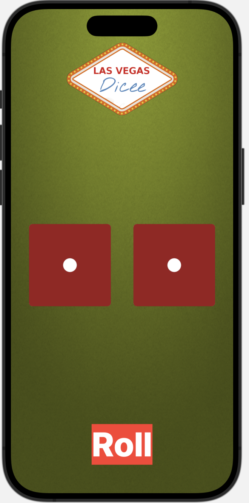

# Tira dados

Crea una aplicación que lance dos dados al azar.

## Requisitos

El interfaz de usuario deberá tener este aspecto:

## Restricciones

- Proyecto de tipo iOS App
- Aplicación desarrollada en SwiftUI con estructura MVVM
- Inicialmente los dados se muestran por defecto los dos a “1”. Cuando el usuario lanza los dados pinchando en “Roll” se muestran nuevos valores aleatorios para ambos dados. El usuario puede lanzar los dados todas las veces que quiera hasta que cierre la aplicación.
- Utilizar Stack Views y views para agrupar los elementos y que sean reutilizables.
- Orientación vertical y horizontal
- Utilizar los recursos proporcionados para el icono de la aplicación, el fondo, el logo y las imágenes de los dados proporcionados.
